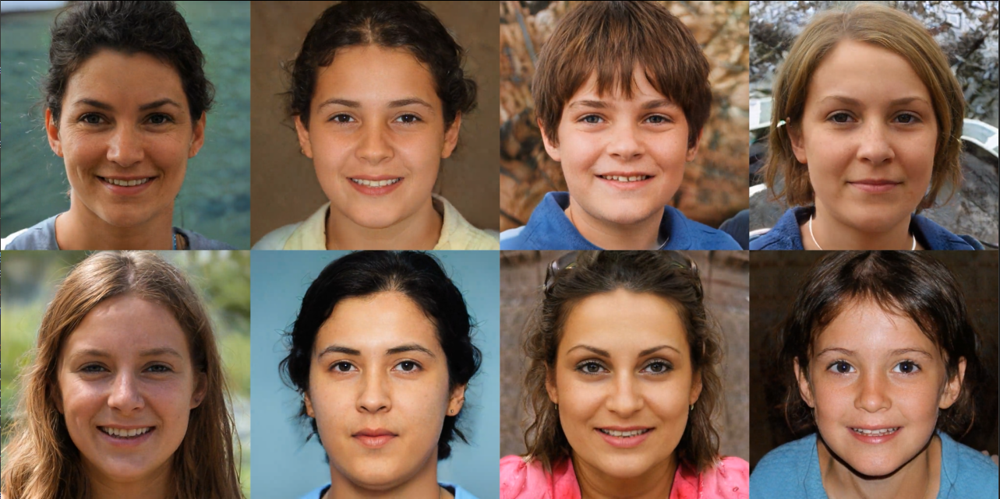

## Jittor Version of StyleGAN3 (Alias-Free Generative Adversarial Networks)<br>



**Alias-Free Generative Adversarial Networks** <br>
Tero Karras, Miika Aittala, Samuli Laine, Erik H&auml;rk&ouml;nen, Janne Hellsten, Jaakko Lehtinen, Timo Aila<br>
https://nvlabs.github.io/stylegan3<br>

## Quick start

Randomly sample face results: <br>
```
python gen_images.py --outdir=out --trunc=1 --seeds=2 --network=./weights/jt_stylegan3_ffhq_weights_t.pkl
```

Generate lerp videos: <br>

```
python gen_video.py --output=lerp.mp4 --trunc=1 --seeds=0-31 --grid=4x2 --network=./weights/jt_stylegan3_ffhq_weights_t.pkl
```

## Notes
We convert the `stylegan3-t-ffhq-1024x1024.pkl` to jittor pkl. 

The Google Drive link: https://drive.google.com/drive/folders/1Gz-MUclZVSD2cAuyVsIIUoNDiXh3nmzw?usp=sharing

Other original weights dicts could also be load easily to test. 

## Acknowledgements

This repository borrows partially from the [original codes](https://github.com/NVlabs/stylegan3) and [jittor_ops](https://github.com/Exusial/jittor-filtered-lrelu) repository.


